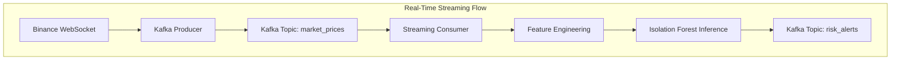

# 🚀 Real-Time Financial Risk Analysis Platform

**Streaming-first financial risk detection powered by machine learning**

Kafka · Python · Machine Learning · MLOps · DevOps · AWS · Docker · Jenkins

---

## 🔍 Overview

This platform delivers **real-time financial risk intelligence** by continuously monitoring live cryptocurrency markets and detecting abnormal price behavior as it happens.

By combining **event-driven streaming**, **machine learning–based anomaly detection**, and **batch risk analytics**, the system provides fast, reliable, and consistent risk insights across both real-time and historical data.

The architecture is designed with production principles in mind, ensuring that **offline model training**, **batch analytics**, and **real-time inference** all operate using the same feature logic and data assumptions.

---

## ✨ What the Platform Does

- Streams live Bitcoin (BTC) prices with low latency  
- Detects abnormal market behavior using machine learning  
- Generates real-time risk alerts  
- Performs historical risk analysis at scale  
- Stores results in cloud-compatible object storage  
- Runs reliably in containerized environments  

---

## 🧠 High-Level Architecture

### Real-Time Streaming Flow



### Batch Risk Analysis Flow

---

## 🔄 Pipelines

### 1️⃣ Offline Machine Learning Training

**Goal:** Train a reliable anomaly detection model using historical data.

**Flow**
fetch_btc.py
↓
build_features.py
↓
btc_features.parquet
↓
train_isolation_forest.py
↓
isolation_forest.joblib


**Features Used**
- Log returns  
- Rolling volatility  
- Z-score  
- Momentum  

The trained model is saved and reused consistently across batch and real-time inference.

---

### 2️⃣ Real-Time Streaming Inference

**Goal:** Detect abnormal market behavior as it occurs.

**Process**
- Stream live BTC prices from Binance  
- Publish price events to Kafka  
- Aggregate prices into short time windows  
- Compute features in real time  
- Apply Isolation Forest inference  
- Publish risk alerts to Kafka  

---

### 3️⃣ Batch Risk Analysis

**Goal:** Generate comprehensive historical risk metrics.

**Process**
- Read partitioned market data from S3-compatible storage  
- Compute returns, volatility, and moving averages  
- Apply ML-based anomaly detection  
- Persist daily risk metrics back to storage  

---

## 🤖 Machine Learning

- **Model:** Isolation Forest  
- **Type:** Unsupervised anomaly detection  
- **Training:** Offline on historical data  
- **Inference:**  
  - Real-time streaming  
  - Batch processing  

Feature engineering logic is **shared across all pipelines**, ensuring stable and predictable model behavior.

---

## 📦 Model & Data Management

- **Models:** Serialized using `joblib`  
- **Features & datasets:** Stored as immutable Parquet files  

### Benefits
- Reproducible results  
- Consistent inference across environments  
- Safe and controlled model updates  

---

## ⚙️ Platform Operations

- **Containerization:** Docker ensures consistent runtime environments  
- **Streaming Infrastructure:** Kafka + Zookeeper via Docker Compose  
- **Automation:** Jenkins handles builds and batch pipeline execution  
- **Storage:** AWS S3 (or S3-compatible object storage) for raw data, processed data, and risk metrics  

---

## 📡 Kafka Topics

| Topic Name       | Description                          |
|------------------|--------------------------------------|
| `market_prices` | Live Bitcoin price stream            |
| `risk_events`   | Intermediate risk calculations       |
| `risk_alerts`   | Detected anomalous market events     |

---

## ▶️ Running Locally

### Start Kafka
```bash
docker-compose.kafka.yml up -d
```
### Train the ML Model
```bash
python ml/training/train_isolation_forest.py
```
### Start Real-Time Streaming
```bash
python ml/streaming/producer.py
python ml/streaming/consumer.py
```

### Run Batch Risk Analysis
```bash
docker build -t real-time-risk-platform .
docker run --rm real-time-risk-platform
```
## 📌 Skills Demonstrated

**DevOps:** Docker, Jenkins, CI/CD, Kafka

**MLOps:** Model training, versioning, feature parity, inference

**Machine Learning:** Isolation Forest, anomaly detection

**Streaming Systems:** Kafka, WebSockets

**Cloud Engineering:** AWS S3, IAM-based credentials

**Software Engineering:** Modular pipelines, clean architecture

## Summary
This platform provides a clear, scalable foundation for both real-time and historical financial risk analysis. Its modular design, consistent data processing, and integrated machine learning pipelines make it suitable for environments where accuracy, reliability, and speed are critical.


